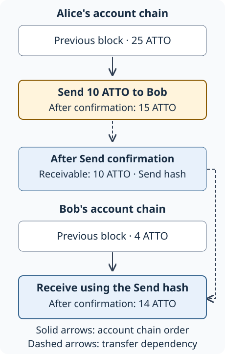

# Atto Technical Whitepaper

:::note Marketing communication — technical information
This crypto-asset marketing communication has not been reviewed or approved by any competent authority in any Member State of the European Union. The person seeking admission to trading of the crypto-asset is solely responsible for the content of this crypto-asset marketing communication.

Atto B.V. · [atto.cash](https://atto.cash) · [+31 85 505 5643](tel:+31855055643) · [contact@atto.cash](mailto:contact@atto.cash).
:::

This document explains Atto's protocol and payment design. For the crypto-asset disclosure, read the **[MiCA Crypto-Asset Whitepaper](./whitepaper-mica.xhtml)**, including its rights, risks, admission-to-trading and sustainability disclosures.

## Summary

Atto is a public digital-cash network for payments by people and software, including AI agents. Transfers carry no protocol fee, allowing small amounts to move without a fixed fee consuming the payment. Each account has its own chain of signed updates, so unrelated accounts can progress concurrently without waiting for a global batch of transactions.

Account owners authorize updates with their keys. Representatives chosen by account holders vote to confirm valid updates through Open Representative Voting (ORV). Their voting weight comes from the balances delegated to them; account owners retain control of spending. Each transaction also requires computational work to raise the cost of spam. [MiCA H.2–H.5](./whitepaper-mica.xhtml#part-h)

A payment connects two account chains. The sender signs an update that deducts the payment from their balance. Once confirmed, it makes funds available for the recipient to claim. The recipient signs another update to claim the payment and add it to their spendable balance when confirmed. The recipient can therefore be offline when the sender pays. [Transfer processing](https://github.com/attocash/node/blob/344ae1e59d8f5b6712cb7a71e66b8d930edf1904/src/main/kotlin/cash/atto/node/transaction/TransactionService.kt)

## Introduction

A service selling an article or a single software request needs a way to collect a small payment. A fixed fee may cost more than the purchase. Services can batch charges or accept prepaid balances, keeping records of usage or unspent customer credit. Atto lets them receive a separate transfer for each purchase without a protocol fee.

A direct payment still requires agreement about who can spend the money. A digital signature shows that an account key authorized an update, but an owner can sign two updates that spend the same balance. The network needs a way to select one consistent history. This is the **double-spending problem** addressed in the [Bitcoin paper, sections 2–5](https://bitcoin.org/bitcoin.pdf).

Atto's **ledger**, the record of account states and transfers, is divided into account chains. Each owner proposes updates to their own account. Computers running **node** software check and share those updates, while representatives vote on which valid updates to confirm. This process of agreeing on account history is called **consensus**. A transfer links the sender's chain to the recipient's chain through separate send and receipt operations. The design belongs to the account-chain and delegated-voting family described in [Nano's original paper, section IV](https://content.nano.org/whitepaper/Nano_Whitepaper_en.pdf).

## Key Features and Design Goals

| Design choice | Payment behavior |
| --- | --- |
| No protocol fee | The recipient can claim the amount sent without a protocol fee deduction. |
| One chain per account | Different accounts can advance concurrently; updates within one account follow its chain order. |
| Separate send and receipt | The sender can pay while the recipient is offline, and the recipient can claim the funds later. |
| Delegated voting | Account holders choose representatives to confirm transactions while retaining their spending keys. |
| Public ledger | Account balances and transfer links are visible to nodes and ledger users. |

## Ledger Structure and Transaction Model

An **account** is controlled by a pair of cryptographic keys: a private key authorizes updates, and a public key lets others verify the signatures. The account's address encodes its public key and a **checksum**, a value used to detect encoding mistakes. The address identifies the account on the ledger. [Address encoding](https://github.com/attocash/commons/blob/b11122e731f7072869ae124943f6d2fbe15b33bc/commons-core/src/commonMain/kotlin/cash/atto/commons/AttoAddress.kt)

Each account update is recorded in a **block** describing an operation and its resulting balance. A **transaction** contains the block, the owner's signature and computational work. The four block types below cover opening an account, sending, receiving and changing representatives. [Block format](https://github.com/attocash/commons/blob/b11122e731f7072869ae124943f6d2fbe15b33bc/commons-core/src/commonMain/kotlin/cash/atto/commons/AttoBlock.kt)

### Local ordering and shared validation

Every block has a **hash**, a fixed-length identifier calculated from its contents, and a **height**, its numbered position in the account chain. The latest confirmed block is the account's **frontier**. Each later block names its predecessor's hash, increases the height by one and records the resulting balance. A Receive also names the Send it claims, so nodes can check where the incoming funds came from. [Ledger validators](https://github.com/attocash/node/tree/344ae1e59d8f5b6712cb7a71e66b8d930edf1904/src/main/kotlin/cash/atto/node/transaction/validation/validator)

Suppose Alice uses the same account in wallet apps on her phone and laptop. Both apps read her seventh block, A7, then independently propose a Send at height 8. Each payment may be correctly signed and affordable, but only one can become the next account state. Before sending the other payment, the apps need to learn which block confirmed and build the next update from it. Applications sharing a signing key therefore need to coordinate account updates across devices.

### Block types

Funds made available by a confirmed Send are called a **receivable**. The recipient claims that transfer with an Open or Receive block.

| Block | Account transition |
| --- | --- |
| **Open** | Starts an account by claiming its first receivable and selecting a representative. |
| **Send** | Decreases the balance by a positive amount and names the recipient. |
| **Receive** | Claims a Send and increases an existing account's balance by that amount. |
| **Change** | Replaces the representative while preserving the balance. |

The initial account is the exception to this receipt requirement. It originates in **genesis**, the configured transaction that establishes the network's initial state and supply. All subsequent account openings claim funds from an existing Send. [Genesis initialization](https://github.com/attocash/node/blob/344ae1e59d8f5b6712cb7a71e66b8d930edf1904/src/main/kotlin/cash/atto/node/transaction/TransactionConfiguration.kt#L78-L110), [MiCA F.6](./whitepaper-mica.xhtml#part-f)

### Transfer process

Alice has 25 ATTO and Bob has 4 ATTO. Alice pays Bob 10 ATTO:

1. Alice constructs a Send that names Bob and changes her balance to 15. She signs it, supplies work and publishes it.
2. Nodes check the transaction and representatives vote to confirm it. The node saves the confirmed update in its database, a step called **persistence**. Alice's balance falls to 15 ATTO and the Send creates a 10 ATTO receivable that only Bob can claim, identified by the Send's hash.
3. Bob constructs a Receive referencing that hash, changing his balance from 4 to 14. Bob signs and supplies work for his own block.
4. Confirmation of Bob's Receive consumes the receivable and updates his account balance. If Bob had no account chain, he would use an Open instead. [Send persistence and receivables](https://github.com/attocash/node/blob/344ae1e59d8f5b6712cb7a71e66b8d930edf1904/src/main/kotlin/cash/atto/node/transaction/TransactionService.kt), [receive validation](https://github.com/attocash/node/blob/344ae1e59d8f5b6712cb7a71e66b8d930edf1904/src/main/kotlin/cash/atto/node/transaction/validation/validator/ReceiveValidator.kt)

<div className="text--center">



</div>

*Figure 1. Solid arrows show the order of blocks within each account. The dashed link connects Alice's Send to Bob's receipt. Each new block requires its owner's signature, work and confirmation.*

| Confirmed state | Alice | Receivable | Bob | Total |
| --- | ---: | ---: | ---: | ---: |
| Before payment | 25 | 0 | 4 | 29 |
| Send confirmed | 15 | 10 | 4 | 29 |
| Receive confirmed | 15 | 0 | 14 | 29 |

The total stays at 29 ATTO throughout this example. After the Send confirms, 10 ATTO is held in the receivable record while Bob's account balance remains at 4. Bob's confirmed Receive moves that amount into his balance and consumes the receivable.

Bob can come online later to receive the payment; Alice's Send can confirm without him. Both confirmations still require communication with the network. Once Alice's Send is confirmed, she has spent the amount. Only Bob can authorize its receipt or a subsequent refund, so Alice cannot cancel the payment while it awaits receipt. If Bob loses his key, he may be unable to claim the funds.

### Amounts and precision

One ATTO is **1,000,000,000 base units**, giving amounts nine decimal places. A payment of 0.001 ATTO is 1,000,000 base units. The maximum supply of 18 billion ATTO corresponds to 18,000,000,000,000,000,000 base units. [Amount definition](https://github.com/attocash/commons/blob/b11122e731f7072869ae124943f6d2fbe15b33bc/commons-core/src/commonMain/kotlin/cash/atto/commons/AttoAmount.kt)

The protocol represents balances as whole numbers of base units, avoiding rounding during balance calculations. Applications need to preserve these integers when reading, storing and signing amounts. The maximum exceeds both JavaScript's exact-integer `Number` range and a signed 64-bit integer, so those types cannot represent every valid balance. Display formatting can round an amount for readability while the underlying calculation retains its exact value.

### Block identity, signatures and work

To sign a block, the wallet first **serializes** it: it turns the fields into a sequence of bytes in the protocol's specified order and encoding. Commons, Atto's shared protocol library, calculates a 32-byte hash of those bytes using BLAKE2b-256. The account key then signs that hash using Ed25519. The transaction contains the block, a 64-byte signature and an 8-byte work value. [Block and transaction serialization](https://github.com/attocash/commons/blob/b11122e731f7072869ae124943f6d2fbe15b33bc/commons-core/src/commonMain/kotlin/cash/atto/commons/AttoTransaction.kt), [signature implementation](https://github.com/attocash/commons/blob/b11122e731f7072869ae124943f6d2fbe15b33bc/commons-core/src/commonMain/kotlin/cash/atto/commons/AttoSignature.kt)

| Mechanism | Who supplies it | Purpose |
| --- | --- | --- |
| Account signature | The account signer | Authorizes the specific block hash. |
| Computational work | A wallet or work service | Adds a computational cost to creating transactions. |
| Representative votes | Representatives | Establish support for confirming a valid account update. |

Generating work means trying values called **nonces** until one produces an acceptable hash when combined with a **work target**. The target is the account public key for Open, or the previous block's hash for later blocks. Because the target is public, a separate service can calculate work without receiving the spending key. The target is also known before the next payment's recipient and amount are chosen, allowing the wallet to prepare work in advance. [Work targets](https://github.com/attocash/commons/blob/b11122e731f7072869ae124943f6d2fbe15b33bc/commons-core/src/commonMain/kotlin/cash/atto/commons/AttoBlock.kt), [work validation](https://github.com/attocash/commons/blob/b11122e731f7072869ae124943f6d2fbe15b33bc/commons-core/src/commonMain/kotlin/cash/atto/commons/AttoWork.kt)

**Advanced detail: encoding and validation.** The block's network identifier, version, field order and integer encoding determine its serialized bytes. Signing a JSON representation instead would produce a signature over different data. Nodes check the signature and work, then verify the account's next height, previous hash, timestamp and balance change. Account timestamps must increase strictly, and Commons rejects block timestamps more than one minute ahead of its clock. A receipt must refer to an available receivable for that recipient and have a timestamp later than the Send. An inaccurate clock or stale account state can therefore cause publication to fail. [Ledger validation](https://github.com/attocash/node/tree/344ae1e59d8f5b6712cb7a71e66b8d930edf1904/src/main/kotlin/cash/atto/node/transaction/validation/validator), [block validation](https://github.com/attocash/commons/blob/b11122e731f7072869ae124943f6d2fbe15b33bc/commons-core/src/commonMain/kotlin/cash/atto/commons/AttoBlock.kt)

**Advanced detail: work calculation.** The work rule joins the nonce bytes to the target bytes, written `nonce || target`, and hashes them with BLAKE2b to produce a 64-bit number. Work is valid when that number is at most the **threshold**. A lower threshold accepts fewer results, increasing the expected search effort.

The threshold follows a schedule based on the network and the block's UTC calendar year. For LIVE, the production-network identifier, the calculation below uses `floor` to round down to a whole number and `div` for integer division, which discards the remainder:

```text
divisor = floor(2^((UTC year − 2024) / 2))
threshold = 8,589,934,591 div divisor
```

In 2026, the divisor is 2 and the threshold is 4,294,967,295. If hash outputs are uniformly distributed, each trial succeeds with probability `(threshold + 1) / 2⁶⁴`. The expected search therefore takes 2³² trials. This is a mathematical expectation; elapsed time depends on the hardware and whether work was prepared in advance. The calendar-based threshold does not respond to current network congestion. [Work calculation](https://github.com/attocash/commons/blob/b11122e731f7072869ae124943f6d2fbe15b33bc/commons-core/src/commonMain/kotlin/cash/atto/commons/AttoWork.kt), [network constants](https://github.com/attocash/commons/blob/b11122e731f7072869ae124943f6d2fbe15b33bc/commons-core/src/commonMain/kotlin/cash/atto/commons/AttoNetwork.kt#L25-L37)

The [protocol signing reference](/docs/integration/advanced/protocol-offline-signing-reference) includes field tables and a worked example of the work-threshold calculation.

## Consensus Mechanism: Open Representative Voting

### Accounts, nodes and representatives

A **node** checks transactions, passes them to other nodes and maintains a copy of the ledger. A **representative** signs votes with its own key. An account owner chooses a representative through Open or Change, assigning the account's confirmed balance as voting weight. The owner keeps the spending key.

Delegating 100 ATTO leaves those 100 ATTO available to spend. When a Send confirms, its amount leaves the sender representative's weight. Open or Receive adds the amount to the recipient representative's weight. Funds awaiting receipt contribute no voting weight. Delegation itself requires no lock; reward programmes may have separate holding conditions. [Weight updates](https://github.com/attocash/node/blob/344ae1e59d8f5b6712cb7a71e66b8d930edf1904/src/main/kotlin/cash/atto/node/vote/weight/VoteWeighter.kt)

The reference node emits votes when configured as a voter and assigned at least 1 million ATTO of representative weight. Delegators can supply that weight, so the operator need not own 1 million ATTO. Nodes below this threshold can still validate and relay transactions. [Vote eligibility](https://github.com/attocash/node/blob/344ae1e59d8f5b6712cb7a71e66b8d930edf1904/src/main/kotlin/cash/atto/node/election/ElectionVoter.kt)

### From a valid block to confirmed history

Return to Alice's phone and laptop proposing different successors to A7. Both proposals have her signature, but her account can have only one block at height 8. The node groups these candidates into an **election** for that account and height. Representatives vote for a block hash, and the node counts each vote using the representative's delegated weight. [Election implementation](https://github.com/attocash/node/blob/344ae1e59d8f5b6712cb7a71e66b8d930edf1904/src/main/kotlin/cash/atto/node/election/Election.kt)

To confirm a candidate, its supporting votes must reach a **quorum**: the minimum combined voting weight required by the node. The node tracks each representative's latest eligible vote, finds the candidate with the most support and compares that support with the quorum. It then saves the chosen block, account balance and transfer state to the database. A database failure can delay this step even after enough votes arrive. [Election persistence](https://github.com/attocash/node/blob/344ae1e59d8f5b6712cb7a71e66b8d930edf1904/src/main/kotlin/cash/atto/node/election/ElectionProcessor.kt)

After saving the account update, a representative broadcasts a vote marked final, telling other nodes which block it has committed. Confirmation is intended to settle that account update without waiting for later global blocks. [Voter behavior](https://github.com/attocash/node/blob/344ae1e59d8f5b6712cb7a71e66b8d930edf1904/src/main/kotlin/cash/atto/node/election/ElectionVoter.kt)

### Weight, availability and trust

Consensus has two requirements. **Safety** means honest nodes do not confirm conflicting histories. **Availability**, also called **liveness**, means valid transactions can eventually confirm. If too much voting weight goes offline, payments may stop progressing while previously confirmed history remains intact.

Agreement depends on nodes validating the same rules, maintaining compatible account and voting-weight views, and exchanging enough votes. A representative's signature identifies who sent a vote; it leaves that representative free to stop voting or support conflicting candidates.

Creating extra representative identities does not create extra delegated balance. This limits a **Sybil attack**, in which one participant creates many identities to gain influence. Control can still concentrate behind several identities: a single operator or custodian may run multiple representatives, and several operators may depend on the same hosting provider. An outage can remove their combined weight. Compromised or cooperating representatives can withhold votes from selected transactions or support conflicting histories.

Owners can choose another representative through a Change, but that block also needs confirmation. Changing representatives therefore depends on the network having enough available voting weight to process the change. ORV governs agreement on account transactions; company decisions and software releases follow separate processes. [MiCA G.1 and H.4–H.7](./whitepaper-mica.xhtml#part-g)

### Advanced detail: quorum calculation {#advanced-detail-quorum-in-the-inspected-node}

The reference configuration sets the quorum at 65% of locally observed online weight, with a floor of 10 billion ATTO. A representative counts as online if the node received a validated vote from it within the last 14 days. The node recalculates the quorum hourly. A representative that has just gone offline can therefore remain in this calculation, raising the amount of support that the remaining voters must supply. [Configuration](https://github.com/attocash/node/blob/344ae1e59d8f5b6712cb7a71e66b8d930edf1904/src/main/resources/application.yaml), [calculation](https://github.com/attocash/node/blob/344ae1e59d8f5b6712cb7a71e66b8d930edf1904/src/main/kotlin/cash/atto/node/vote/weight/VoteWeighter.kt)

With weights expressed in base units:

```text
Q = max((W_online div 100) × 65, Q_min)
```

Here `div` is integer division, `W_online` is the observed online weight, `Q` is the required weight and `Q_min` is the configured floor. For example, 18 billion ATTO of online weight gives a quorum of 11.7 billion. With 12 billion online, the calculated 7.8 billion falls below the floor, so confirmation still requires 10 billion. These examples use the default configuration. The floor limits how far the quorum can fall as participation decreases, but confirmation stops when reachable support falls below it.

During an election, the node uses its current representative weights to total votes. A signed vote identifies a block; it does not identify the particular distribution of delegated balances against which to count it. As balances and delegations change, nodes can temporarily assign different weights to the same votes. The node also excludes a representative's vote for five seconds after it switches candidates, while first votes have no such delay. [Vote structure](https://github.com/attocash/commons/blob/b11122e731f7072869ae124943f6d2fbe15b33bc/commons-core/src/commonMain/kotlin/cash/atto/commons/AttoVote.kt), [election rules](https://github.com/attocash/node/blob/344ae1e59d8f5b6712cb7a71e66b8d930edf1904/src/main/kotlin/cash/atto/node/election/Election.kt)

The practical safety concern is whether nodes counting votes against different balance distributions can confirm different successors to the same account block. A formal analysis would need to establish when honest nodes must agree and how much dishonest or unavailable weight the protocol can tolerate. The 65% setting alone supplies neither that fault bound nor a guarantee of agreement across network partitions.

## Performance and Security Considerations

### What determines payment latency

A customer waits while the application obtains account state, signs a block, finds work, publishes it and observes confirmation. Nodes need time to exchange votes and save the result. Some work can happen in advance or overlap with other steps. The recipient then needs a separate Open or Receive before spending the payment. If a response is lost, the application may continue waiting after the transaction has already confirmed.

The [metrics page](/metrics) displays daily and seven-day confirmation statistics. The reference collector measures the interval from a transaction's arrival at a node (`received_at`) to its storage (`persisted_at`), combining observations from two node databases. Each interval covers one transaction at one node. A complete payment also includes wallet preparation and a separate recipient operation. A transaction seen at both nodes can contribute two observations; an operation that never reaches storage contributes no completed interval. Collector source: `e433457da752` (not publicly accessible at the research cutoff, 7 September 2026).

P50 is the median observed interval: half the observations are at or below it. P95 and P99 describe the slower portions of the sample, with 95% and 99% of observations at or below their respective values. The remaining observations can take longer. Throughput also depends on the workload, hardware, network layout and software version. Measuring sustained capacity requires recording failed and unfinished operations as well as completed ones.

### Feeless transfers still consume resources

Separate account chains allow unrelated accounts to advance concurrently, but nodes share finite CPU, bandwidth, memory and database capacity across those accounts. They must validate transactions and votes, store history and catch up after downtime. More powerful hardware may increase capacity while making independent node operation more expensive.

The reference node limits its transaction queues and the number of active elections. It filters duplicates and holds some transactions until their dependencies confirm. Full queues can drop transactions. Work makes transaction submission more costly, but other messages still consume resources and overload remains possible. Operators cover these costs without collecting protocol transaction fees. [Transaction prioritization](https://github.com/attocash/node/tree/344ae1e59d8f5b6712cb7a71e66b8d930edf1904/src/main/kotlin/cash/atto/node/transaction/prioritization), [node limits](https://github.com/attocash/node/blob/344ae1e59d8f5b6712cb7a71e66b8d930edf1904/src/main/resources/application.yaml)

**Advanced detail: transaction size.** A binary Send occupies 206 bytes including signature and work; a Receive occupies 198 bytes. The example payment therefore contains 404 bytes of transaction data. Votes, repeated transmission, transport framing, JSON, indexes and database records add to that amount. These two serialized transactions account for only part of the resources needed to process a payment. [Serialized sizes](https://github.com/attocash/commons/blob/b11122e731f7072869ae124943f6d2fbe15b33bc/commons-core/src/commonMain/kotlin/cash/atto/commons/AttoTransaction.kt)

### Failure modes and their boundaries

| Failure | Consequence and response |
| --- | --- |
| Invalid signature or balance change | Validation rejects the transaction, even if someone votes for it. |
| Competing blocks at the same account height | The election must select one successor before the account can continue. |
| Missing prior block or receivable | The node needs the dependency before it can apply the transaction. Applications must also refresh stale account state. |
| Overload or unavailable voting weight | A transaction may be dropped or remain unconfirmed; submission alone is insufficient to fulfil an order. |
| Lost response | Look up the saved transaction hash before creating another payment; the original may already have confirmed. |
| Lost or compromised key | Losing the secret can make funds inaccessible. Someone who obtains it can sign as the owner. |

These are the protocol's intended responses. Software defects can undermine validation or confirmation, as the audit findings below describe. Payment applications also handle matters outside ledger consensus, including fulfilment, price quotes and refunds.

### Privacy and reliance on remote nodes {#privacy-and-the-observation-boundary}

Atto's public blocks expose account identities, balances, amounts and transfer links. Signatures authenticate this information without encrypting it. An address contains no person's name, but merchant records, exchange accounts or repeated payments can connect it to one. Using a new address leaves its public funding path visible. [Public block format](https://github.com/attocash/commons/blob/b11122e731f7072869ae124943f6d2fbe15b33bc/commons-core/src/commonMain/kotlin/cash/atto/commons/AttoBlock.kt)

A wallet connected to a remote node uses that node's account state and confirmation reports. The Commons publication client checks that the response contains the submitted block hash. That check catches an acknowledgement for a different block; the response contains no voting history from which the wallet could independently verify consensus. Operating a node lets the application validate and observe the ledger itself, subject to the same consensus rules and software risks. [Remote client](https://github.com/attocash/commons/blob/b11122e731f7072869ae124943f6d2fbe15b33bc/commons-node-remote/src/commonMain/kotlin/cash/atto/commons/node/AttoNodeClientRemote.kt), [response check](https://github.com/attocash/commons/blob/b11122e731f7072869ae124943f6d2fbe15b33bc/commons-node/src/commonMain/kotlin/cash/atto/commons/node/AttoNodeOperations.kt#L85-L92)

### Implementation and audit evidence

The MiCA disclosure reports internal agent-assisted reviews of specific source versions: node `bea907de7097` had one Critical and ten High findings, wallet `e8e6305bf0e2` had four High findings, and Commons `a3ccc6f625ca` had one High finding. Selected Commons fixes received a partial re-review at `0a745ddfcee0`. [MiCA H.8–H.9](./whitepaper-mica.xhtml#part-h)

These reviews were internal and did not provide independent assurance or release approval. The disclosure leaves gaps in evidence of remediation and deployment. The revisions described here differ from those reviewed, so the reported findings cannot be treated as closed without tracing the fixes, verifying them and identifying the deployed artifacts. [MiCA I.5–I.6](./whitepaper-mica.xhtml#part-i)

## Use Cases: Micropayments, AI Agents and In-Person Payments {#use-cases-micropayments-and-face-to-face-transactions}

### Micropayments {#enabling-true-micropayments}

A **micropayment** pays for a small unit of value, such as a tip, an article or one request to a software service. A service can expose an **application programming interface (API)** so another program can request its data or functions. To charge for a request, it records the expected amount, destination and order reference, then matches a confirmed transfer to that order. The order reference identifies the purchase; the Send hash identifies its ledger transfer. Recording which orders have been delivered prevents a repeated payment notification from delivering the same purchase twice.

Atto permits small payments recorded directly on its ledger without a protocol fee. A service may still batch usage because signing, work, confirmation tracking and accounting have costs. Payment channels, such as those proposed in Lightning, instead keep repeated balance updates between channel participants and use an underlying ledger to enforce settlement. Channels reduce the updates that the wider network processes, while adding funding and settlement mechanics. The useful choice depends on the workload. [Lightning design, sections 1–3](https://lightning.network/lightning-network-paper.pdf)

### AI agents and software payments

An AI agent may need to buy a data lookup, an API response or access to an online tool to complete a task. It may need that service only once. A fixed transaction fee can exceed that request's price, making separate payment impractical even when the service itself is inexpensive. Paying per request would let an agent buy only the calls it needs, without a monthly bundle or a prepaid balance at every provider. Confirmation delay also matters when the agent needs the result before it can take its next step. [Why instant and feeless are inclusive](/blog/why-instant-and-feeless-are-inclusive)

An application could quote an amount in ATTO for each call, match the confirmed transfer to the request and return the result. Atto's nine decimal places allow exact small amounts without a protocol fee deduction. The agent's payment application signs the transfer and records which request it paid for. Software payments use the same signatures, representative voting and send/receipt process as payments between people.

### Payments in person {#instant-payments-in-person}

A checkout can display a QR code with the destination and amount. It first shows **payment requested**, then **payment detected** when it sees a transfer to check. The application verifies the destination and amount and waits for **Send confirmed**, when the funds become available for the merchant to receive. **Receipt confirmed** means those funds have entered the merchant's spendable balance. **Order fulfilled** records that the goods or service were delivered. A customer's screenshot cannot replace these checks.

The merchant chooses when to deliver the order, how long a price quote remains valid and how to handle underpayment, overpayment or late arrival. The merchant also handles currency conversion and delivery disputes. Refunds are new transfers and require an agreed destination and amount.

### Payment failure recovery

If a connection fails after sending a transaction, the payment may already have succeeded. Save the transaction hash with the order before publication. After reconnecting, use that hash to check the transaction and compare the account's confirmed history with the saved payment. Only create another payment once the original outcome is understood.

<div className="text--center">


</div>

*Figure 2. Check the original transfer after a lost response: retrying the purchase with a new Send could pay twice.*

| Observation after interruption | Application response |
| --- | --- |
| Original Send confirmed | Keep the original order and check whether the merchant has received its funds. |
| Receipt confirmed | Record the received funds and check the order record before delivering it. |
| The node cannot find the hash or cannot be reached | Reconnect and check the transaction and account history. One node's missing result does not establish failure. |
| A different block advanced the account | Check which operation confirmed and whether it paid this order before creating another transaction. |
| Duplicate notification | Match the saved Send hash and order record; count the payment once. |

**Advanced detail — publishing APIs.** Both `POST /transactions` and `POST /transactions/stream` return the transaction after local confirmation, with a 40-second timeout on the confirmation wait. The latter uses newline-delimited JSON (NDJSON), with a JSON value on each line. Success follows a stored account update or recognition that the transaction is already the account's latest confirmed block. `GET /transactions/{hash}` queries stored history. Publishing with `deduplicate=true` can return an already confirmed result or share the pending request for the same hash. The application must still save its own payment and order records. [Controller implementation](https://github.com/attocash/node/blob/344ae1e59d8f5b6712cb7a71e66b8d930edf1904/src/main/kotlin/cash/atto/node/transaction/TransactionController.kt)

The [protocol signing reference](/docs/integration/advanced/protocol-offline-signing-reference#publishing-transactions-rest) describes request formats and confirmation responses. Examine the returned transaction as well as the HTTP status. A request timeout, or a node dropping an operation from its queue, does not undo a transaction confirmed elsewhere.

The referenced wallet send screen reports caught errors as payment failures. It does not separately show an unknown outcome after a lost response, so a failure message can require the transaction-history checks described above. [Wallet send handling](https://github.com/attocash/wallet/blob/b7bcf7e2f859953f0d444045dbd1d3d0c7289a5d/composeApp/src/commonMain/kotlin/cash/atto/wallet/viewmodel/SendTransactionViewModel.kt)

### Protocol and service access {#global-and-accessible-to-all}

An account can exchange signed transactions over the internet through a node. Access to a particular wallet, work service or exchange also depends on that service's availability and terms. Exchanges may require identity checks and restrict accounts by country or transaction route. Buying, selling, deposits and withdrawals can have different restrictions and costs. [MiCA E.33–E.36](./whitepaper-mica.xhtml#part-e)

## Tokenomics and Distribution

All 18 billion ATTO were created at genesis on 23 November 2024. The disclosure records this initial allocation: [MiCA D.8–D.9](./whitepaper-mica.xhtml#part-d)

| Historical allocation | Share | ATTO |
| --- | ---: | ---: |
| Network incentives | 35% | 6,300,000,000 |
| Development | 40% | 7,200,000,000 |
| Community rewards | 24% | 4,320,000,000 |
| Founder allocation | 1% | 180,000,000 |
| **Total** | **100%** | **18,000,000,000** |

This is the original split of the supply. Subsequent transfers change the allocation accounts' holdings and the amount in wider circulation; the table does not report those current balances. [MiCA D.9](./whitepaper-mica.xhtml#part-d)

The faucet, Folding@Home, staking and contribution programmes distribute units from these accounts under separate eligibility rules. Their rewards transfer existing ATTO rather than create new units. Folding@Home rewards scientific computation, and staking rewards have programme-specific holding and delegation conditions; neither supplies the consensus mechanism. Choosing a representative alone creates no unconditional reward entitlement. Programme terms can change, but changes must respect obligations already accrued or accepted. [Distribution](/docs/distribution), [MiCA G.1–G.3](./whitepaper-mica.xhtml#part-g), [H.5](./whitepaper-mica.xhtml#part-h)

The **Growth Stability Index (GSI)** changes how quickly selected allocations distribute their ATTO. Its intended response is to slow releases when market-price conditions move downward and allow faster releases when they move upward. The aim is to reduce volatility relative to a fixed release schedule; an actual stabilizing effect has not been established. GSI changes neither the fixed supply nor units already held by users. It sets no price peg or minimum value and guarantees neither a return nor an opportunity to sell. Treasury management and market making are separate activities. The disclosure leaves the complete programme coverage, update frequency, override rules and checks against actual payouts unresolved. [MiCA G.12–G.15](./whitepaper-mica.xhtml#part-g)

Holding ATTO lets an owner use the transfer and delegation functions. It does not make the holder a shareholder or creditor of Atto B.V., or give a corporate vote, dividend, redemption, backing or compensation right. There is no guaranteed price, liquidity or return. ATTO also grants no entitlement to goods or services supplied by the issuer; its payment and voting functions are protocol capabilities. [MiCA G.1–G.3](./whitepaper-mica.xhtml#part-g)

The MiCA document concerns admission to trading, with no issuer public sale or collection of subscription funds. Its trading-venue references carry dated access qualifications; naming a market does not ensure a holder can trade or withdraw there. [MiCA E.1–E.3 and E.33–E.36](./whitepaper-mica.xhtml#part-e)

## Governance and Decentralization

Decentralization has several dimensions: who owns the units, who receives delegated weight, who controls representatives, who supplies hosting and connectivity, and who maintains the software and service interfaces. More accounts or representative names do not necessarily mean more independent control.

Atto B.V. operates core infrastructure and controls allocations and distribution parameters. Independent community nodes can participate; they are not thereby agents of the company. Delegation lets users redirect transaction-voting influence, but does not give holders a formal corporate or protocol-upgrade ballot. Software development, operator adoption and programme management are separate decisions. [MiCA E.38](./whitepaper-mica.xhtml#part-e), [G.1–G.3](./whitepaper-mica.xhtml#part-g), [H.6–H.7](./whitepaper-mica.xhtml#part-h)

For example, several representatives hosted by one provider may all become unavailable during the same outage. Several addresses controlled by one operator also concentrate decision-making despite appearing separately in a voter list. Evaluating independence therefore requires knowing who controls the voting weight and which infrastructure they share. Wider participation can help, but adoption alone does not ensure decentralized control.

## Network Status and Accessibility

The MiCA document dated 1 September 2026 identifies transfers, consensus, the web wallet, explorer and developer interfaces as existing functions. It describes payment infrastructure for software requests as in progress. The atto.market beta, merchant integrations and content-payment functions are planned without committed delivery dates; their scope and order may change. [MiCA F.3 and F.10](./whitepaper-mica.xhtml#part-f)

The reference implementation uses a Kotlin node and a MySQL database to maintain the ledger. Wallets and applications communicate through web interfaces, including transaction streams, while nodes exchange messages over persistent connections. Commons supplies shared transaction and cryptographic functions. Historical-service nodes and voting nodes have different storage and deployment needs. [Node guide](/docs/integration/node), [MiCA H.2–H.3](./whitepaper-mica.xhtml#part-h)

| Component | Responsibility and dependency |
| --- | --- |
| Wallet/application | Construct the intended payment and record its outcome. |
| Signer | Use the account's secret key to authorize a block hash. |
| Work generator | Find a valid work nonce without needing the spending key. |
| Node and database | Check, share and store ledger updates; answer application queries. |
| Representative | Sign votes that carry delegated weight. |
| Explorer | Display account history and transactions. |

A wallet can depend on a working node and still be unable to send because its signer or work service is unavailable. Moving a signer to a remote service also changes who may control the spending key; outsourcing work generation does not require that key. These choices determine both custody and which services a payment needs. [Signer guide](/docs/integration/signer), [wallet-server guide](/docs/integration/wallet-server)

## Risk Factors

Payment risks extend beyond confirmation. Losing a key can make funds inaccessible; a mistaken confirmed transfer cannot be recalled unilaterally. Public transaction history can expose financial relationships. A holder may lose value as prices fall or be unable to sell when needed. Service restrictions, software faults and unavailable voting weight can interrupt payments.

The project also depends on a small team and continued funding. The MiCA disclosure reports financial and continuity uncertainty, related-party funding, potential conflicts of interest and unresolved security findings. Funding support and future delivery are not guaranteed. See [Part A.17](./whitepaper-mica.xhtml#part-a), [E.38](./whitepaper-mica.xhtml#part-e) and [Part I](./whitepaper-mica.xhtml#part-i).

## Environmental Impact

Atto consumes electricity through node operation, databases, supporting infrastructure and transaction-work generation. Representative voting avoids a competitive mining process for consensus, but the amount of electricity used depends on the equipment and how it runs.

The MiCA document reports **11,388 kWh for the full year 2026 as a qualified, unmetered estimate**. The model assumes 25 node processes at 40 watts each, running throughout the year. A factor of 1.3 adds attributed facility overhead, such as cooling, to the computing load:

```text
E = processes × watts × hours × uptime × overhead / 1,000
  = 25 × 40 × 8,760 × 1.0 × 1.3 / 1,000
  = 11,388 kWh
```

Changing the assumptions gives the disclosed sensitivity range of 2,365.2–52,560 kWh. The assumed 25 processes are not a verified node count. The estimate covers validating and ledger-maintaining processes, their integral database activity and attributed host/facility overhead. It excludes end-user devices, wallets, exchanges, websites, explorers and separately unmetered auxiliary services. It has no measured operating-data basis, renewable-energy allocation or independent verification. [MiCA S.6–S.9](./whitepaper-mica.xhtml#part-s)

This annual infrastructure estimate cannot tell a reader how much additional electricity one payment uses. Dividing it by a payment count would spread the assumed yearly consumption across those payments. A meaningful comparison with another system would need measurements covering equivalent equipment, services and workloads.

## Conclusion

Atto organizes direct payments around account chains: the sender authorizes a debit, voting confirms the transfer, and the recipient later adds it to their own balance. Signatures establish spending authority, work adds a cost to transaction creation, and representative votes establish confirmed history. This separation supports concurrent payments without a protocol transaction fee.

For a person buying an article or an agent calling a paid service, the useful result is a payment the application can identify, confirm and match to what was purchased. The ledger provides the transfer; the application completes the exchange. The [MiCA Crypto-Asset Whitepaper](./whitepaper-mica.xhtml) gives the accompanying rights, trading, risk and sustainability disclosures.
